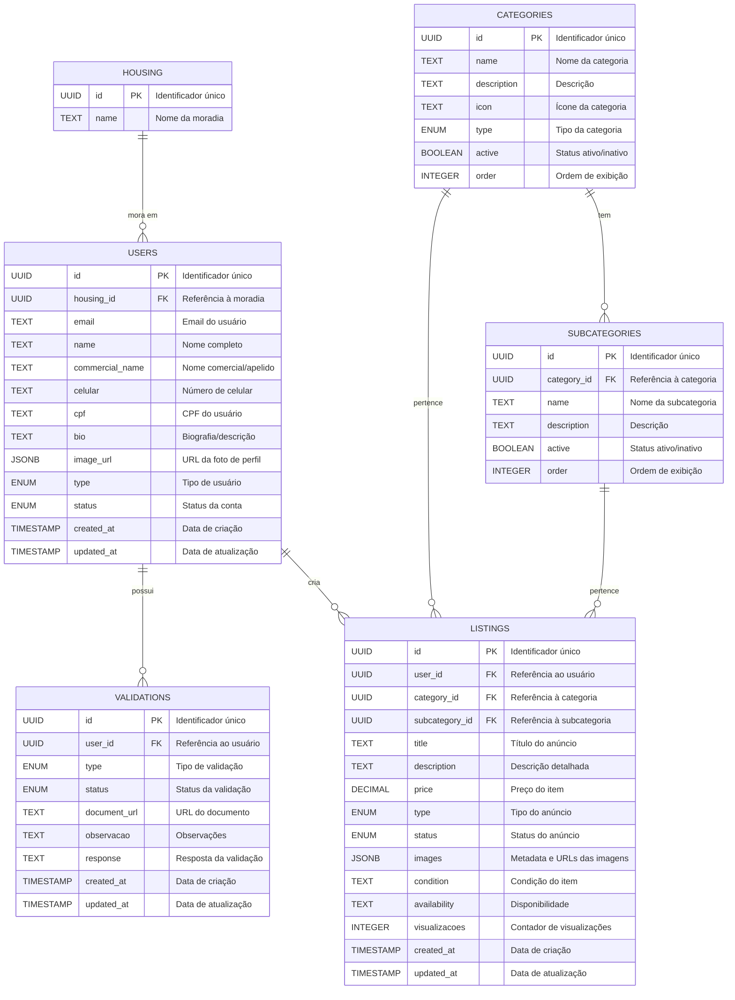

# 🗄️ Arquitetura do Banco de Dados

> MoraHub - Documentação técnica do esquema de dados e fluxos principais

## 📊 Diagrama ER



## 🔄 Tipos ENUM

### User Type
| Valor | Descrição | Permissões |
|-------|-----------|------------|
| `VISITOR` | Visitante sem vínculo | Visualização básica |
| `UFMG` | Membro da comunidade UFMG | Acesso a todas funcionalidades |
| `RESIDENT` | Morador de moradia | Acesso privilegiado |
| `ADMIN` | Administrador do sistema | Acesso total |

### User Status
| Valor | Descrição | Comportamento |
|-------|-----------|---------------|
| `ACTIVE` | Conta ativa | Acesso total |
| `INACTIVE` | Conta inativa | Acesso restrito |
| `BLOCKED` | Conta bloqueada | Sem acesso |

### Validation Type
| Valor | Descrição | Requisitos |
|-------|-----------|------------|
| `HOUSING` | Validação de moradia | Comprovante de residência |
| `UFMG_AFFILIATION` | Vínculo UFMG | Documento institucional |

### Validation Status
| Valor | Descrição | Próximos Passos |
|-------|-----------|-----------------|
| `PENDING` | Em análise | Aguardar revisão |
| `APPROVED` | Aprovado | Acesso liberado |
| `REJECTED` | Rejeitado | Submeter novamente |

### Category Type
| Valor | Descrição | Características |
|-------|-----------|-----------------|
| `PRODUCT` | Produto físico | Requer imagens |
| `SERVICE` | Serviço | Requer descrição detalhada |

### Listing Type
| Valor | Descrição | Características |
|-------|-----------|-----------------|
| `SALE` | Venda | Requer preço |
| `RENT` | Aluguel | Requer valor mensal |
| `DONATION` | Doação | Sem custo |
| `EXCHANGE` | Troca | Requer descrição do interesse |

### Listing Status
| Valor | Descrição | Comportamento |
|-------|-----------|---------------|
| `ACTIVE` | Disponível | Visível para todos |
| `SOLD` | Vendido | Não visível |
| `RESERVED` | Reservado | Visível com marca d'água |
| `DELETED` | Removido | Não visível |

## 📝 Notas Técnicas

### Convenções
- Todos os `id` são UUIDs v4
- Timestamps apenas em tabelas que necessitam tracking temporal (listings, users, validations)
- Campos JSONB para estruturas complexas (ex: images)
- Campos de texto longos são limitados a 2000 caracteres
- Preços são armazenados com 2 casas decimais
- Validação e sanitização de dados críticos (CPF, celular) feita no frontend

### Índices
#### Primary Keys
- `categories_pkey`: Chave primária para categorias
- `housing_pkey`: Chave primária para housing
- `listings_pkey`: Chave primária para listings
- `subcategories_pkey`: Chave primária para subcategorias
- `users_pkey`: Chave primária para users
- `validations_pkey`: Chave primária para validations

#### Unique Keys
- `users_email_key`: Garante email único por usuário
- `users_cpf_key`: Garante CPF único por usuário

#### Índices de Performance
- `idx_active_listings`: Otimiza busca de anúncios ativos
- `idx_listings_price_range`: Otimiza busca por faixa de preço
- `idx_listings_search`: Otimiza busca textual em anúncios

#### Índices Compostos
```sql
CREATE INDEX idx_listings_composite ON listings (
    category_id,
    subcategory_id,
    status,
    price DESC,
    created_at DESC
);
```

Este índice composto otimiza as queries mais comuns do marketplace:
- Listagem por categoria/subcategoria
- Filtragem por status
- Ordenação por preço
- Ordenação por data de criação

### Constraints
- Chaves estrangeiras com DELETE CASCADE
- Campos obrigatórios: id, created_at

### Segurança
- Row Level Security (RLS) ativo
- Políticas por tipo de usuário
- Auditoria de mudanças
- Backup diário

## 🔄 Fluxos Principais

### Criação de Anúncio
1. Usuário autenticado cria listing
2. Validação de campos obrigatórios
3. Processamento de imagens
4. Notificação para moderação

### Validação de Usuário
1. Upload de documentos
2. Criação do registro de validação
3. Análise por administrador
4. Atualização de status

## 📚 Referências

- [Documentação PostgreSQL](https://www.postgresql.org/docs/)
- [Supabase Schema](https://supabase.com/docs/guides/database)
- [Mermaid ER Diagrams](https://mermaid.js.org/syntax/entityRelationshipDiagram.html)
